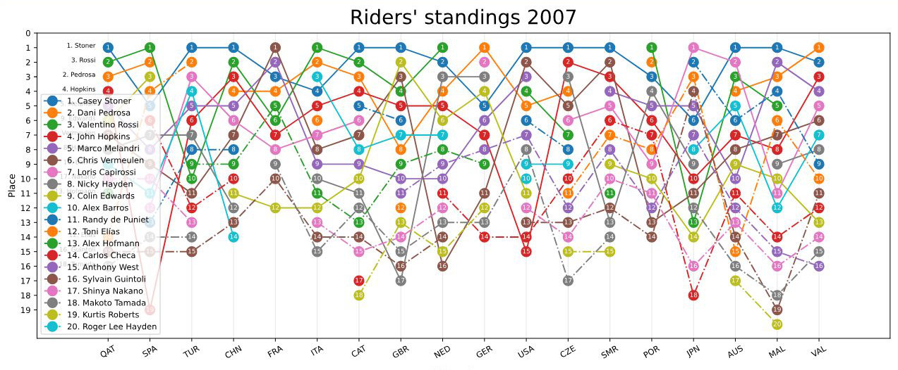

# MotoGP_stats
### Django test project

- [x] View the change in MotoGP rider form throughout the season. 
- [x] Check the historical average performance on a given track. 
- [x] Compare with other drivers. 
- [x] Check the conditions during any race in MotoGP history.

## Rider's standings

You can see how the performance of the chosen rider changed over the season. Breaks mean the rider didn't finish the race.

You can plot up to 20 riders or choose just 5 from the middle. The names are sorted by the overall result at the end of the season.

You can see if a rider over- or underperformed by viewing average results from previous seasons. They are semitransparent, and keep the same rider color:

The average for the given rider on a given track is being calculated by taking at least 2 previous results from 3 previous years. If a rider didn't finish at least 2 races, the marker is not being shown.

## Weather

Application has access to all historical races' weather data, such as:
- air temperature
- track temperature 
- cloud cover
- humidity
- and track dryness

to let you know the precise race conditions.

## Configuration

You can set: 
- year, from 2004 to the present (the newest races will be added automatically during the season)
- option to show historical average
- riders to show:

## Disclaimer

This is a non-commercial test project to get me proficient with Django, matplotlib, pandas, numpy, web scrapping and caching files. Riders' results are being scraped from Wikipedia. Weather data gathered from API.